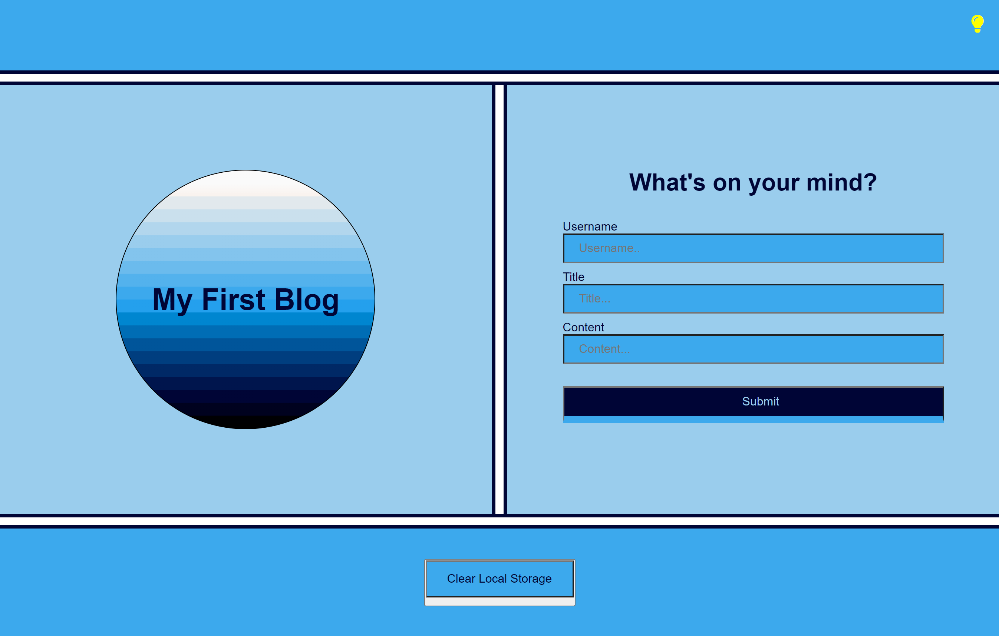
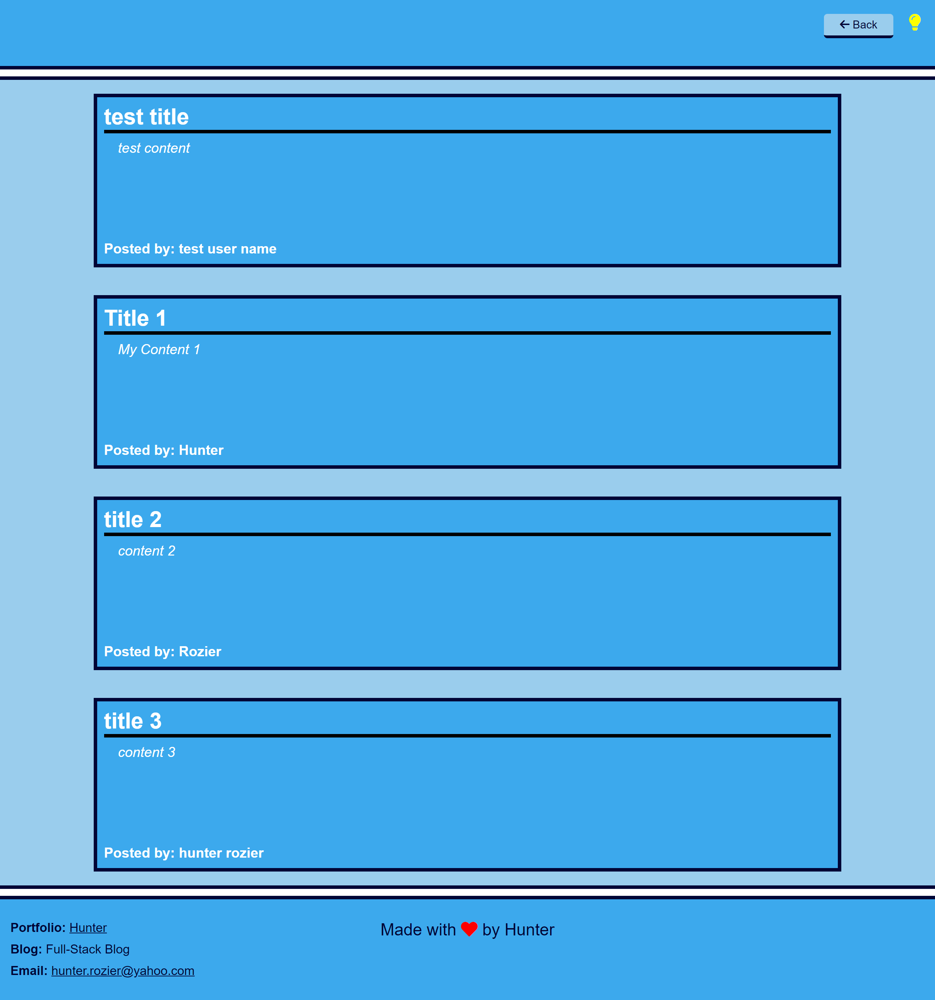
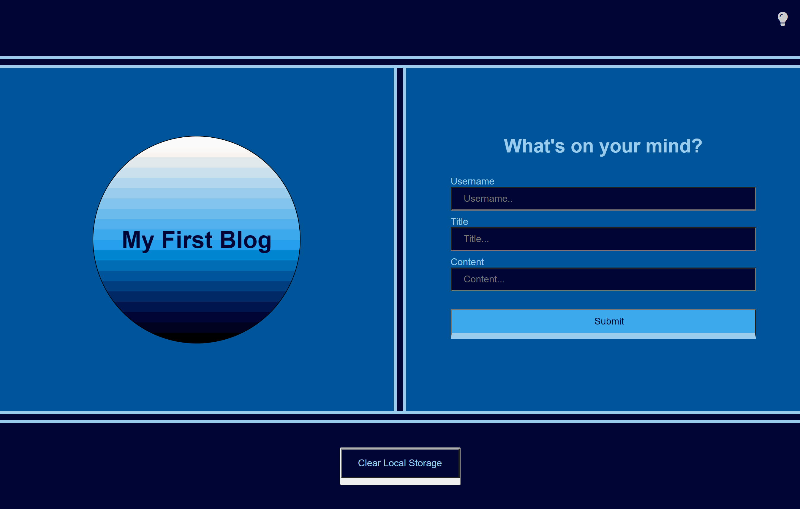
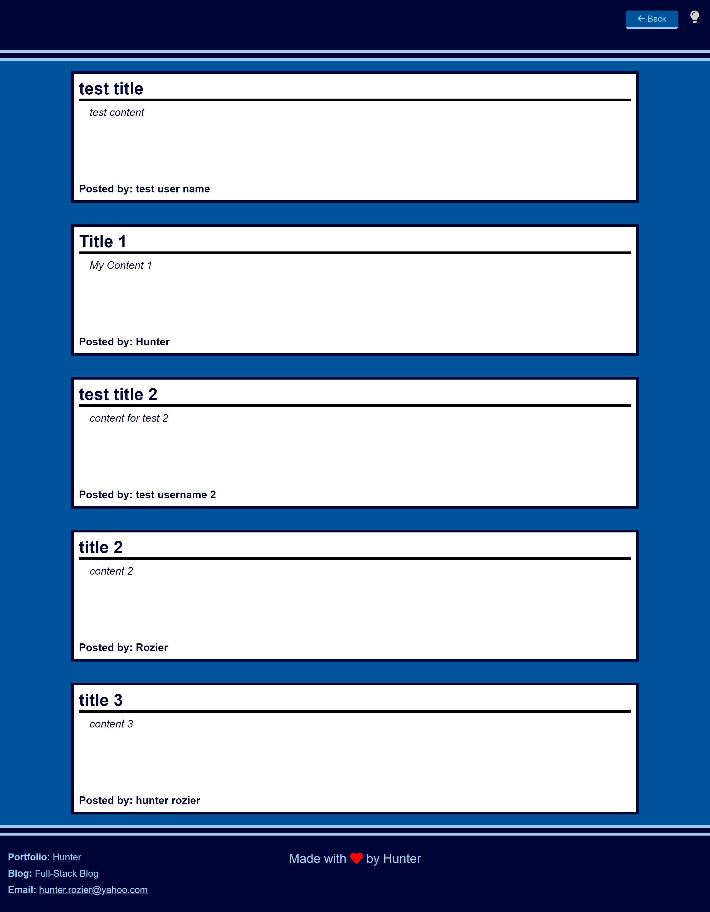

# ch05.blog.post

## Description

The focus of this challenge was on dynamically creating html elements and styling them with JavaScript. In additiion to that, there was a focus on adding values into local storage and calling values from local storage, utilizing JSON. This challenge was also the first practice of toggling between two seperate webpages. Using JavaScript with JSON, the program stored users input values from a form into local storage on one the homepage and then pulled the values out of local storage and displayed them on the next page. Using JavaScript the program controlled the page style, which required a value to be put in local storage so that on page re-load, the program could keep the same style in place until the user chose to change things

## Usage

Here is a [link to the webpage](https://rozierhj.github.io/ch05.blog.post/index.html)

This is what the web page should like like when this challenge is complete.

Light Mode Homepage

Ligh Mode Blog Posts
 

Dark Mode Homepage
 

Dark Mode Blog Posts
  

A video of [The Webpage in action](https://app.screencastify.com/v3/watch/BNGVJT8Dz7fipOhJPVpb)